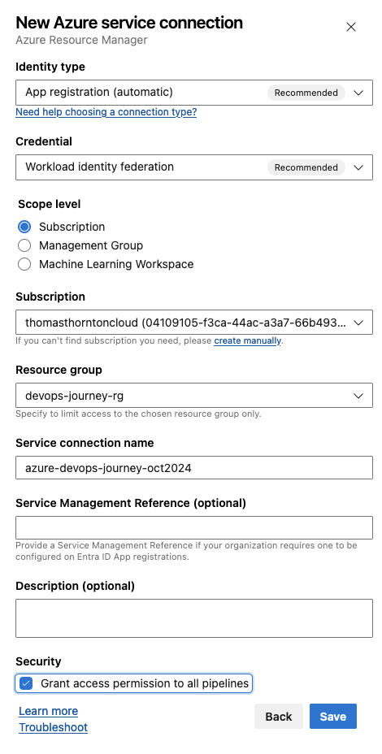
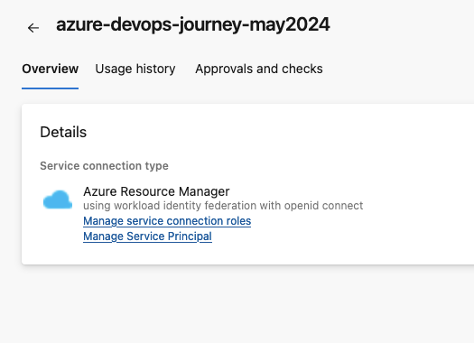
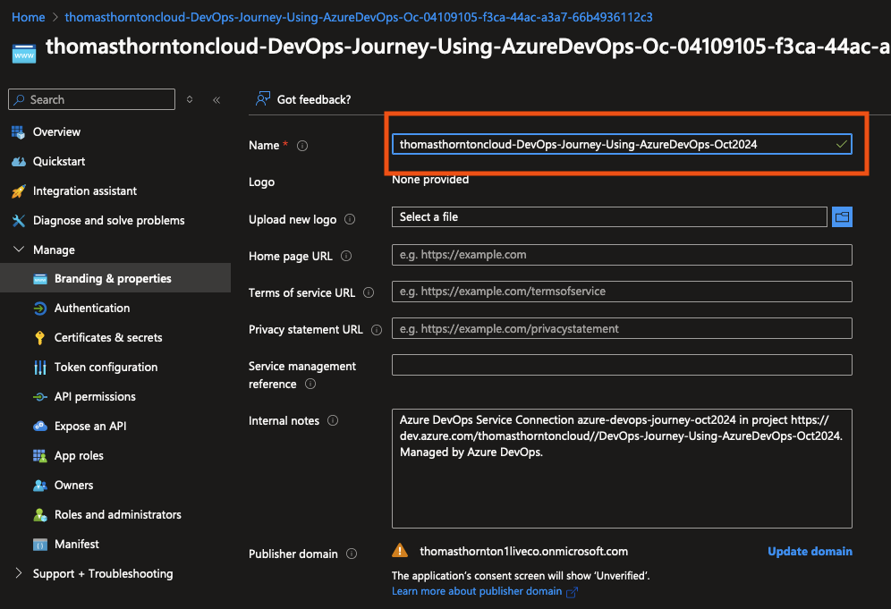
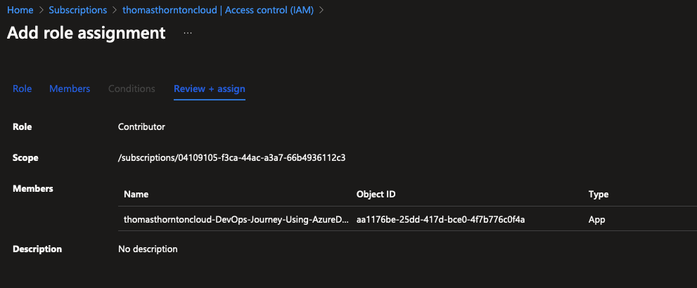

# Azure DevOps setup

## Azure DevOps Organisation Setup
The first setup to setting up Azure DevOps is to create an organisation

1. [Sign into Azure DevOps](https://go.microsoft.com/fwlink/?LinkId=307137)
2. Select **New Organisation**
3. Enter your preferred Azure DevOps organisation name and hosting location. (For this lab, the organisation name is thomasthorntoncloud.)
4. Once your organisation is created, you can access it anytime using:
`https://dev.azure.com/{yourorganisation}`

Once an organisation has been setup, next is to create an Azure DevOps project

## Azure DevOps Project Creation
Creating a project allows you to utilise repositories, pipelines, and other features within Azure DevOps.

1. [Sign into Azure DevOps](https://go.microsoft.com/fwlink/?LinkId=307137)
2. Select organisation that you have created above
3. Select **New Project**
4. Enter new project name & description

## Azure Workload Identity Federation
Using a Workload Identity Federation is considered best practice for DevOps within your CI/CD pipeline. It serves as an identity to authenticate within your Azure Subscription, allowing you to deploy the relevant Terraform code.

1. To begin creation, within your newly created Azure DevOps Project – select **Project Settings**
2. Select **Service Connections**
3. Select **Create Service Connection** -> **Azure Resource Manager** -> **Workload Identity federation (Automatic)**
4. Enter subscription/resource group to where service connection will be created. Create with relevant service connection name

5. Once created, you will see a similar screen. You can select **Manage Workload Identity** to review further details.

6. Within **Manage Workload Identity** options, update the branding and name to give a relevant identity name (it initially has a random string at the end).

7. Assign the necessary Service Principal role to the subscription. For this lab, the Workload Identity will be given **User Access Admin**(required to add rbac control during AKS deploy stage) access to the subscription.
Service Principal Role Assignment

You are now all set and ready to deploy to Azure using Azure DevOps!