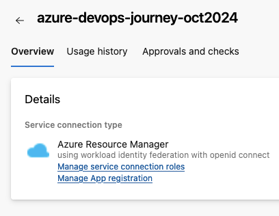

# Azure DevOps setup

## 🎯 Purpose
Set up Azure DevOps environment for efficient DevOps practices and pipeline management.

## Azure DevOps Organisation Setup & Project Creation

Creating a project allows you to utilise repositories, pipelines, and other features within Azure DevOps.

1. [Sign into Azure DevOps](https://go.microsoft.com/fwlink/?LinkId=307137)
2. Select organisation that you have created above
3. Select **New Project**
4. Enter new project name & description

### 🔍 Verification:
- Confirm access to your new organisation URL
- Confirm your new project appears in the organisation dashboard

### 🧠 Knowledge Check:
- Why is creating an Azure DevOps organisation the first step?
- What information is required when setting up an organisation?
- What features become available after creating a project?
- How does project creation facilitate team collaboration?

#### 💡 Pro Tip: Use clear, descriptive project names and descriptions to help team members understand the project's purpose at a glance.

## Azure Workload Identity Federation
Using a Workload Identity Federation is considered best practice for DevOps within your CI/CD pipeline. It serves as an identity to authenticate within your Azure Subscription, allowing you to deploy the relevant Terraform code.

1. To begin creation, within your newly created Azure DevOps Project – select **Project Settings**
2. Select **Service Connections**
3. Select **Create Service Connection** -> **Azure Resource Manager** -> **Workload Identity federation (Automatic)**
4. Enter subscription/resource group to where service connection will be created. Create with relevant service connection name

5. Once created, you will see a similar screen. You can select **Manage Workload Identity** to review further details.

6. Within **Manage Workload Identity** options, update the branding and name to give a relevant identity name (it initially has a random string at the end).

7. Assign the necessary Service Principal role to the subscription. For this lab, the Workload Identity will be given **User Access Admin**(required to add rbac control during AKS deploy stage) access to the subscription.
Service Principal Role Assignment

### 🔍 Verification:
- Check that the Workload Identity appears in your Azure Active Directory
- Confirm the assigned role in Azure subscription

### 🧠 Knowledge Check:
- Why is Workload Identity Federation considered best practice for DevOps CI/CD pipelines?
- What role does the Service Principal play in Azure resource deployment?

#### 💡 Pro Tip: Regularly review and update the permissions assigned to your Workload Identity to maintain the principle of least privilege.

You are now all set and ready to deploy to Azure using Azure DevOps!
