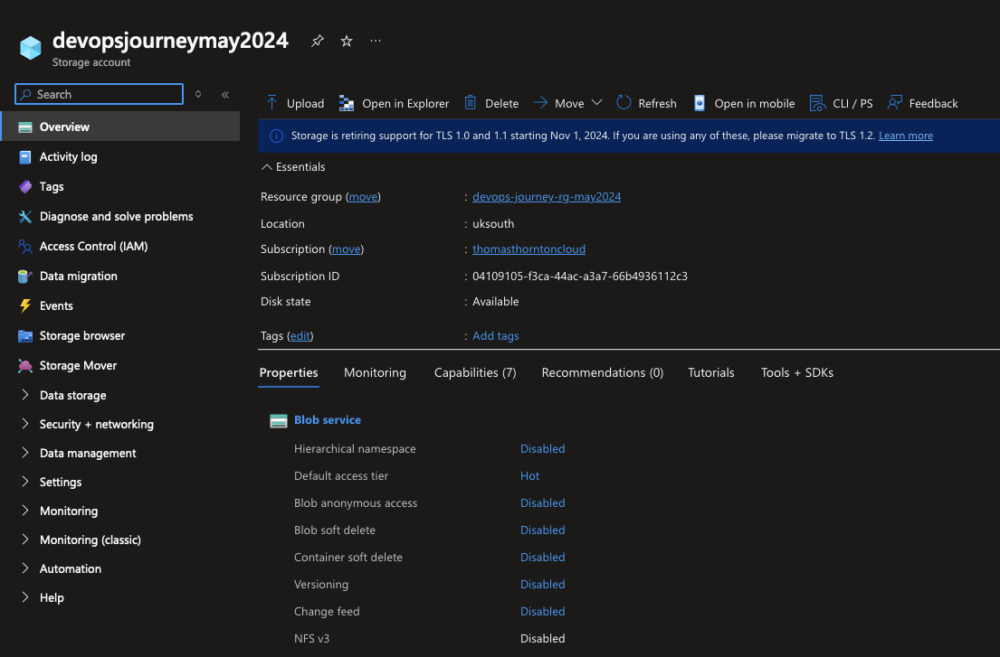

# Azure Terraform Setup

In this lab, you will create a storage location for the remote Terraform state file.

When deploying with Terraform, a state file is required. This file is used by Terraform to map Azure resources to your configuration, track metadata, and improve performance for larger deployments.

## Create Blob Storage location for Terraform State file
1. Edit the [variables](https://github.com/thomast1906/DevOps-Journey-Using-Azure-DevOps/blob/main/1-Initial-Setup/scripts/create-terraform-storage.sh#L3-L4)
2. Run the script `./scripts/create-terraform-storage.sh`
3. The script will create the following:
- Azure Resource Group
- Azure Storage Account
- Azure Blob storage location within Azure Storage Account

This setup ensures that your Terraform state file is securely stored and easily accessible for your deployments.