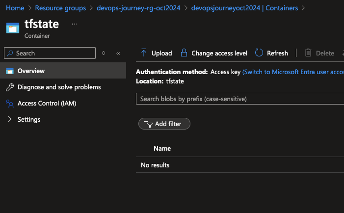

# Configure Storage Account for Terraform State File

## 🎯 Purpose
In this lab, you'll create a secure location to store the remote Terraform State file. This is crucial for maintaining consistency and collaboration in your infrastructure-as-code projects.

## 🛠️ Create Blob Storage for Terraform State File

### Prerequisites
- [ ] Azure CLI installed and configured
- [ ] Basic understanding of Azure Storage concepts

### Steps

1. **Customise Variables**
   - Open the [create-terraform-storage.sh](https://github.com/thomast1906/DevOps-Journey-Using-Azure-DevOps/blob/main/1-Initial-Setup/scripts/create-terraform-storage.sh) script.
   - Locate the following lines:
   
     ```bash
        RESOURCE_GROUP_NAME="devops-journey-rg-oct2024"
        STORAGE_ACCOUNT_NAME="devopsjourneyoct2024"
     ```

   - Replace the placeholders with your desired names.

   2. **Run the Script**

   - Run the following command in your terminal:

     ```bash
     ./scripts/create-terraform-storage.sh
     ```

3. **What's Happening Behind the Scenes?**
   The script performs these actions:
   - [ ] Creates an Azure Resource Group
   - [ ] Sets up an Azure Storage Account
   - [ ] Establishes an Azure Blob storage container

### 🔍 Verification
To ensure everything was set up correctly:

1. Log into the [Azure Portal](https://portal.azure.com).
2. Navigate to your newly created Resource Group.
3. Verify the presence of the Storage Account.
4. Within the Storage Account, check for the Blob container.
5. It should look similar to this:



### 🧠 Knowledge Check
After running the script, try to answer these questions:
1. Why is it important to use remote state storage for Terraform?
2. What are the benefits of using Azure Blob Storage for this purpose?
3. How would you access this state file in your Terraform configurations?

#### 💡 Pro Tip Consider: setting up access policies and encryption for your storage account to enhance security. Azure provides several options for this, including Azure AD authentication and Azure Key Vault integration.