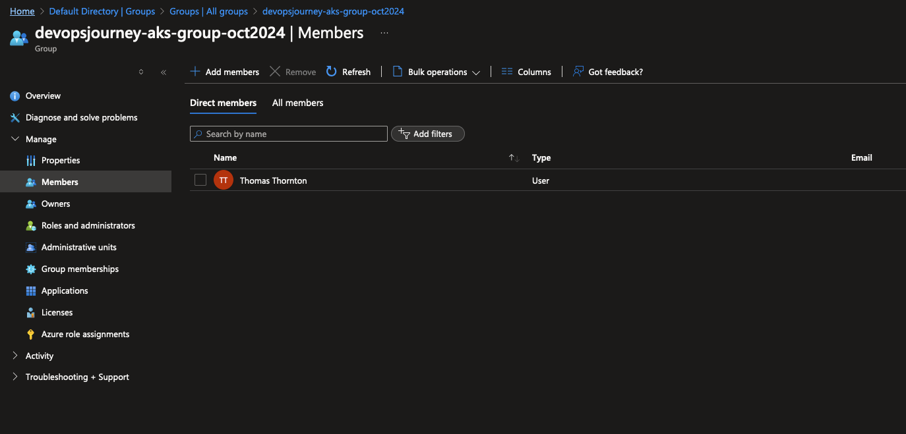

# Create Azure AD Group for AKS Admins

In this lab, you will create an Azure AD Group for AKS Admins. These "admins" will be the designated users who can access the AKS cluster using kubectl.

## Create Azure AD AKS Admin Group
1. Run the script `./scripts/create-azure-ad-group.sh`
2. The script will create
- Create an Azure AD Group named `devopsthehardway-aks-group` .
- Add the current user logged into Az CLI to the AD Group `devopsthehardway-aks-group`.
- Output the Azure AD Group ID. Make sure to note this down as it will be required for AKS Terraform configurations.

`AZURE AD GROUP ID IS: 01e9e3d0-bdd3-4b2a-b630-eff0ab594f59`

Group has been created and the current user has been added to the group:

