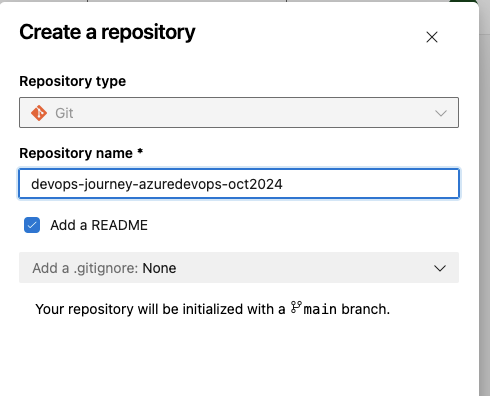
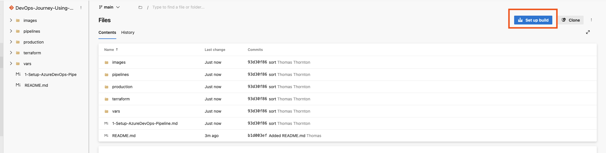
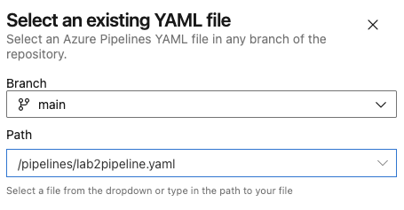
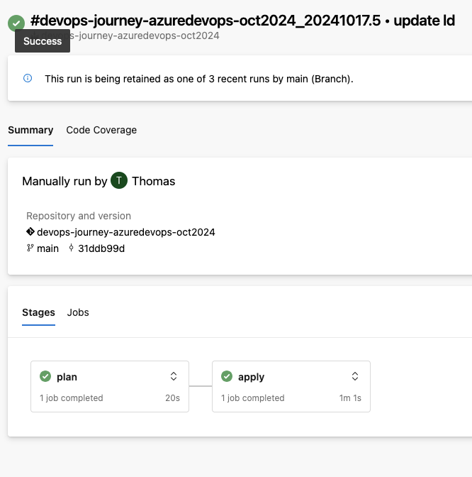

# Setting Up Azure DevOps Pipeline for Terraform Deployment

## 🎯 Purpose
Configure Azure DevOps to deploy Terraform configurations into Azure.


## 1. Install Terraform Extension in Azure DevOps
1. Install the Terraform extension/task from [here](https://marketplace.visualstudio.com/items?itemName=ms-devlabs.custom-terraform-tasks) into your Azure DevOps organisation


This extension allows you to run Terraform commands within Azure Build and Release Pipelines, supporting the following commands:

- `init`
- `validate`
- `plan`
- `apply`
- `destroy`


#### 🔍 Verification:
- Confirm the extension appears in your Azure DevOps organization

#### 🧠 Knowledge Check:
1. What Terraform commands does this extension support?
2. Why is this extension necessary for Terraform deployments in Azure DevOps?

##### 💡 Pro Tip: Familiarise yourself with the extension's capabilities to maximise its use in your pipelines.

## 2. Create an Azure repository

1. Navigate to Repos in Azure DevOps. Here, you will find various options to set up a repository. 
2. Create a new repository to store your code. Note that this repository will be used for subsequent labs as well.



#### 🔍 Verification:
Confirm the new repository is visible in your Azure DevOps project

#### 🧠 Knowledge Check:
1. Why is creating a separate repository important for this project?
2. How does this repository fit into the overall DevOps workflow?

#### 💡 Pro Tip: Use meaningful naming conventions for your repository to easily identify its purpose.

## Update the Terraform .tfvars configuration

1. Update the [production.tfvars](https://github.com/thomast1906/DevOps-Journey-Using-Azure-DevOps/blob/main/labs/2-AzureDevOps-Terraform-Pipeline/vars/production.tfvars) file with your values. This file contains the values that will be used by Terraform to create the resources in Azure.
2. `access_policy_id` is the object group ID that you created as part of initial setup [here](https://github.com/thomast1906/DevOps-Journey-Using-Azure-DevOps/blob/main/labs/1-Initial-Setup/3-Create-Azure-AD-AKS-Admins.md) 

```hcl
access_policy_id = "278cc1b9-653d-464a-90f7-309e02d4b5d1"
```

#### 🔍 Verification:
- Double-check that all values in the .tfvars file are correct

#### 🧠 Knowledge Check:
1. What is the purpose of the .tfvars file in Terraform?
2. Why is the access_policy_id particularly important?

##### 💡 Pro Tip: Consider using Azure Key Vault to securely store sensitive values used in your Terraform configurations. 


## Update the Azure DevOps Pipeline YAML file

1. Update the [azure-pipelines.yml](https://github.com/thomast1906/DevOps-Journey-Using-Azure-DevOps/blob/main/labs/2-AzureDevOps-Terraform-Pipeline/pipelines/lab2pipeline.tfvars) file with your values:

(All values from the initial setup)
- backendServiceArm: Azure DevOps service connection name that was created in the initial setup
- backendAzureRmResourceGroupName: Azure Resource Group name where the Terraform state file will be stored.
- backendAzureRmStorageAccountName: Azure Storage Account name where the Terraform state file will be stored.

```yaml
  - name: backendServiceArm
    value: 'azure-devops-journey-oct2024'
  - name: backendAzureRmResourceGroupName
    value: 'devops-journey-rg-oct2024'
  - name: backendAzureRmStorageAccountName
    value: 'devopsjourneyoct2024'
```

#### 🔍 Verification:
1. Review the YAML file to ensure all values match your Azure environment

#### 🧠 Knowledge Check:
1. What is the purpose of each value in the YAML file?
2. How do these values connect to your Azure resources?

##### 💡 Pro Tip: Use variables in your YAML file to make it more flexible and reusable across different environments.

## Set Up and Run Azure DevOps Pipeline

1. Copy contents from this folder into the newly created Azure DevOps repository
2. Once copied to Azure DevOps repository, Select **Repo** -> **Setup Build**

3. Select **Existing Azure Pipelines YAML file** and branch  / path to the .yaml Azure DevOps Pipeline

4. Save pipeline and run


#### 🔍 Verification:
1. Confirm the pipeline runs successfully without errors

#### 🧠 Knowledge Check:
1. What steps does the pipeline execute?
2. How would you troubleshoot if the pipeline fails?

##### 💡 Pro Tip: Always review the pipeline logs after each run to catch and address any issues early.