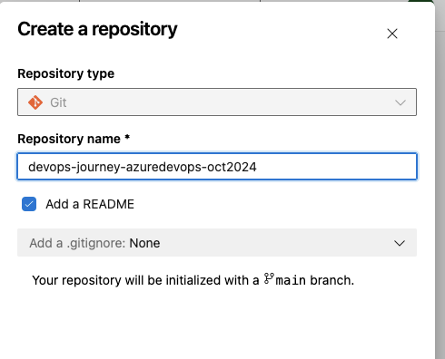
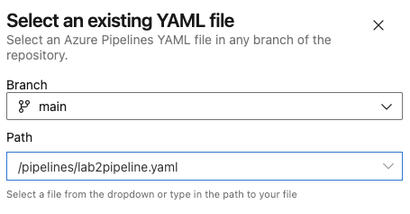
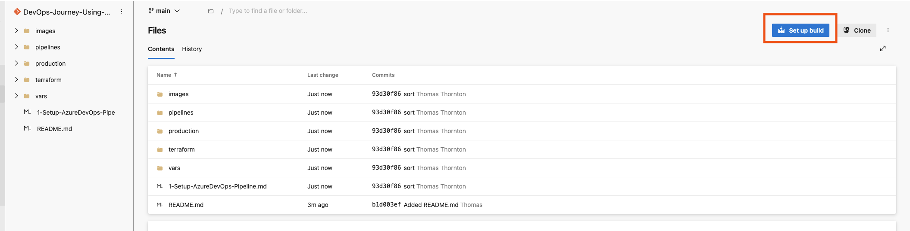
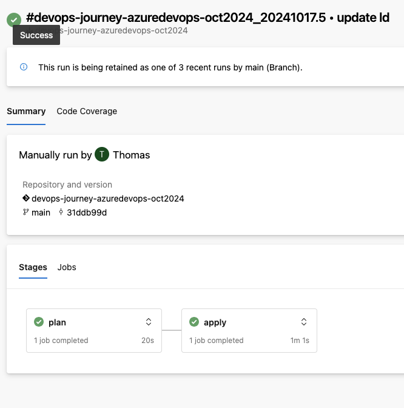

# ⚙️ Set Up Azure DevOps Pipeline for Terraform

> **Estimated Time:** ⏱️ **25-35 minutes**

## 🎯 **Learning Objectives**

By the end of this lab, you will:
- [ ] **Install the Terraform extension** — enabling Terraform tasks (`init`, `plan`, `apply`) in Azure Pipelines
- [ ] **Create an Azure DevOps repository** — to host all pipeline YAML, Terraform code, and app source
- [ ] **Configure `production.tfvars`** — with your environment-specific values including `admin_object_id`
- [ ] **Update the pipeline YAML** — with your Terraform backend (storage account, resource group, service connection)
- [ ] **Run the pipeline** — to provision the full AKS infrastructure via Terraform

## 📋 **Prerequisites**

**✅ Required Knowledge:**
- [ ] Terraform basics (variables, state, `init`/`plan`/`apply`)
- [ ] Azure DevOps pipeline concepts (stages, tasks, YAML)

**🔧 Required Tools:**
- [ ] Azure DevOps organisation and project (from Lab 1.1)
- [ ] Azure CLI authenticated (`az login`)

**🏗️ Infrastructure Dependencies:**
- [ ] Completed [Lab 1.1 — Azure DevOps Setup](../1-Initial-Setup/1-Azure-DevOps-Setup.md) — WIF service connection created
- [ ] Completed [Lab 1.2 — Terraform Remote Storage](../1-Initial-Setup/2-Azure-Terraform-Remote-Storage.md) — storage account and container created
- [ ] Completed [Lab 1.3 — AKS Admin Group](../1-Initial-Setup/3-Create-Azure-AD-AKS-Admins.md) — Group Object ID recorded

---

## 🚀 **Step-by-Step Implementation**

### **Step 1: Install the Terraform Extension** ⏱️ *5 minutes*

1. **🔌 Navigate to the Marketplace**

   Go to the [Terraform extension on the Azure DevOps Marketplace](https://marketplace.visualstudio.com/items?itemName=ms-devlabs.custom-terraform-tasks) and click **Get it free**.

2. **🏢 Select your organisation**

   Choose your Azure DevOps organisation (e.g., `devopsjourneyoct2024`) and click **Install**.

   

   The extension adds the following pipeline tasks:
   - `TerraformInstaller@1` — downloads and installs a specific Terraform version
   - `TerraformTaskV4@4` — runs `init`, `validate`, `plan`, `apply`, or `destroy`

   **✅ Expected Output:**
   ```
   Extension "Terraform" successfully installed to your organisation.
   ```

---

### **Step 2: Create an Azure DevOps Repository** ⏱️ *5 minutes*

1. **📁 Navigate to Repos**

   In your Azure DevOps project, click **Repos** in the left navigation.

2. **➕ Create a new repository**

   Click the repository dropdown → **New repository**.
   - Name: `DevOps-Journey` (or your preferred name)
   - Keep **Add a README** checked

   

3. **📋 Copy the repository contents**

   Clone the repo and push the contents from this GitHub repository:

   ```bash
   # Clone your new Azure DevOps repo
   git clone https://dev.azure.com/<your-org>/DevOps-Journey/_git/DevOps-Journey
   cd DevOps-Journey

   # Copy the lab 2 contents into it
   cp -r /path/to/labs/2-AzureDevOps-Terraform-Pipeline/* .
   git add -A
   git commit -m "Initial Terraform pipeline setup"
   git push
   ```

---

### **Step 3: Update `production.tfvars`** ⏱️ *5 minutes*

1. **📝 Open the tfvars file**

   Open [`labs/2-AzureDevOps-Terraform-Pipeline/vars/production.tfvars`](https://github.com/thomast1906/DevOps-Journey-Using-Azure-DevOps/blob/main/labs/2-AzureDevOps-Terraform-Pipeline/vars/production.tfvars) and update the values for your environment.

2. **🔑 Set `admin_object_id`**

   This is the **Entra ID Group Object ID** from Lab 1.3. It grants the group:
   - Key Vault Administrator RBAC on the Key Vault
   - AKS Cluster Admin RBAC on the AKS cluster

   ```hcl
   # Replace with your actual values
   admin_object_id = "278cc1b9-653d-464a-90f7-309e02d4b5d1"
   ```

   > ⚠️ Use `admin_object_id` — **not** the old name `access_policy_id`. The Key Vault in this repo uses **RBAC-based** access control, not legacy access policies.

   Other values to review and update in the tfvars file:
   ```hcl
   resource_group_name    = "devopsjourneyoct2024-rg"
   location               = "uksouth"
   cluster_name           = "devopsjourneyoct2024"
   kubernetes_version     = "1.33"
   acr_name               = "devopsjourneyoct2024acr"
   key_vault_name         = "devopsjourneyoct2024-kv"
   ```

---

### **Step 4: Update the Pipeline YAML** ⏱️ *5 minutes*

1. **📝 Open the pipeline YAML**

   Open [`labs/2-AzureDevOps-Terraform-Pipeline/pipelines/lab2pipeline.yaml`](https://github.com/thomast1906/DevOps-Journey-Using-Azure-DevOps/blob/main/labs/2-AzureDevOps-Terraform-Pipeline/pipelines/lab2pipeline.yaml) and update the backend variables:

   ```yaml
   variables:
     - name: backendServiceArm
       value: 'azure-devops-journey-oct2024'        # ← Your WIF service connection name
     - name: backendAzureRmResourceGroupName
       value: 'devops-journey-rg-oct2024'           # ← Your Terraform state RG
     - name: backendAzureRmStorageAccountName
       value: 'devopsjourneyoct2024'                # ← Your storage account name
     - name: backendAzureRmContainerName
       value: 'tfstate'
     - name: backendAzureRmKey
       value: 'production.tfstate'
   ```

   > 💡 These values connect Terraform to the Azure Blob backend you created in Lab 1.2.

---

### **Step 5: Set Up and Run the Pipeline** ⏱️ *10 minutes*

1. **🔧 Create the pipeline in Azure DevOps**

   - Navigate to **Pipelines** → **New Pipeline**
   - Choose **Azure Repos Git** → select your repository
   - Choose **Existing Azure Pipelines YAML file**
   - Select the branch and path to `lab2pipeline.yaml`

   

2. **💾 Save and run**

   Click **Save and run**.

   

3. **📋 Review pipeline stages**

   The pipeline runs the following Terraform stages:
   - **Validate** — `terraform validate` checks HCL syntax
   - **Plan** — `terraform plan` previews all resources to be created
   - **Apply** — `terraform apply` provisions the infrastructure

   

   **✅ Expected Output (Terraform Apply stage):**
   ```
   Apply complete! Resources: 25 added, 0 changed, 0 destroyed.

   Outputs:
     aks_cluster_name       = "devopsjourneyoct2024"
     acr_name               = "devopsjourneyoct2024acr"
     key_vault_name         = "devopsjourneyoct2024-kv"
     resource_group_name    = "devopsjourneyoct2024-rg"
   ```

---

## ✅ **Validation Steps**

**🔍 Infrastructure Validation:**
- [ ] Pipeline completes all stages (Validate, Plan, Apply) with green ticks
- [ ] AKS cluster `devopsjourneyoct2024` visible in Azure Portal
- [ ] ACR `devopsjourneyoct2024acr` created
- [ ] Key Vault `devopsjourneyoct2024-kv` created with RBAC access control enabled
- [ ] Application Insights workspace-based resource created

**🔧 Technical Validation:**
```bash
# Verify AKS cluster
az aks show \
  --name devopsjourneyoct2024 \
  --resource-group devopsjourneyoct2024-rg \
  --query "{Name:name, K8sVersion:kubernetesVersion, State:provisioningState}" -o table

# Verify ACR
az acr show \
  --name devopsjourneyoct2024acr \
  --query "{Name:name, LoginServer:loginServer, SKU:sku.name}" -o table

# Verify Key Vault (RBAC-based)
az keyvault show \
  --name devopsjourneyoct2024-kv \
  --resource-group devopsjourneyoct2024-rg \
  --query "{Name:name, RBAC:properties.enableRbacAuthorization}" -o table
```

**✅ Expected Output:**
```
Name                   K8sVersion    State
---------------------  ------------  ---------
devopsjourneyoct2024   1.33.x        Succeeded

Name                     LoginServer                              SKU
-----------------------  ---------------------------------------  ------
devopsjourneyoct2024acr  devopsjourneyoct2024acr.azurecr.io       Premium

Name                      RBAC
------------------------  ------
devopsjourneyoct2024-kv   True
```

---

## 🚨 **Troubleshooting Guide**

**❌ Common Issues:**

```bash
# Problem: Pipeline fails at Terraform Init with "AuthorizationFailed"
# Solution: Ensure the WIF service connection has Contributor + User Access Admin on the subscription
az role assignment list \
  --assignee "$(az ad sp list --display-name 'azure-devops-journey-identity' --query '[0].id' -o tsv)" \
  --query "[].roleDefinitionName" -o tsv

# Problem: "admin_object_id is not set" or Terraform variable error
# Solution: Check production.tfvars — ensure admin_object_id is populated with the correct group ID
az ad group show --group "devopsjourney-aks-group-oct2024" --query id -o tsv

# Problem: AKS version "1.33" not available in your region
# Solution: List available versions
az aks get-versions --location uksouth --query "values[].version" -o tsv | sort -V | tail -5

# Problem: Pipeline cannot access Terraform state storage account
# Solution: Assign Storage Blob Data Contributor to the WIF service principal on the storage account
az role assignment create \
  --assignee "<wif-sp-object-id>" \
  --role "Storage Blob Data Contributor" \
  --scope "/subscriptions/<sub-id>/resourceGroups/devops-journey-rg-oct2024/providers/Microsoft.Storage/storageAccounts/devopsjourneyoct2024"
```

---

## 💡 **Knowledge Check**

**🎯 Questions:**
1. What is the purpose of the `backendServiceArm` variable in the pipeline YAML?
2. Why is `admin_object_id` used instead of `access_policy_id` in this repo?
3. What Kubernetes version is this lab targeting, and where is it configured?
4. Why does the Workload Identity need **User Access Administrator** (not just Contributor)?

**📝 Answers:**
1. **`backendServiceArm` authenticates Terraform's Azure backend** — it tells the `TerraformTaskV4` task which Azure DevOps service connection to use when reading/writing the remote state file in Azure Blob Storage.
2. **The Key Vault uses RBAC authorization** (`enableRbacAuthorization = true`) — not legacy access policies. The `admin_object_id` is used to create a **Key Vault Administrator** role assignment, which is the RBAC equivalent. `access_policy_id` was the old name used when Key Vault access policies were configured.
3. **Kubernetes `1.33`** — configured in `production.tfvars` as `kubernetes_version = "1.33"`. AKS uses the **patch upgrade channel** so patch versions are managed automatically.
4. **User Access Administrator is needed to create role assignments** — Terraform creates RBAC assignments (e.g., ACR pull for AKS, Key Vault roles) during `terraform apply`. Contributor alone cannot manage role assignments.

---

## 🎯 **Next Steps**

**✅ Upon Completion:**
- [ ] Terraform extension installed in Azure DevOps
- [ ] Azure DevOps repository created
- [ ] `production.tfvars` updated with your values (including `admin_object_id`)
- [ ] Pipeline YAML updated with backend configuration
- [ ] Full AKS infrastructure provisioned via pipeline

**➡️ Continue to:** [Lab 3 — Deploy Application to ACR](../3-Deploy-App-to-ACR/1-Deploy-App-to-ACR.md)

---

## 📚 **Additional Resources**

- 🔗 [Terraform extension for Azure DevOps](https://marketplace.visualstudio.com/items?itemName=ms-devlabs.custom-terraform-tasks)
- 🔗 [AzureRM Terraform Provider `>= 4.68.0`](https://registry.terraform.io/providers/hashicorp/azurerm/latest)
- 🔗 [AKS — Supported Kubernetes versions](https://learn.microsoft.com/en-us/azure/aks/supported-kubernetes-versions)
- 🔗 [Azure Key Vault — Enable RBAC authorization](https://learn.microsoft.com/en-us/azure/key-vault/general/rbac-guide)