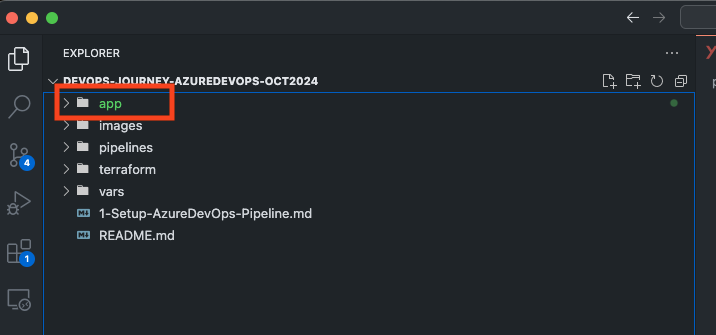
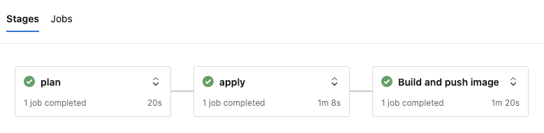
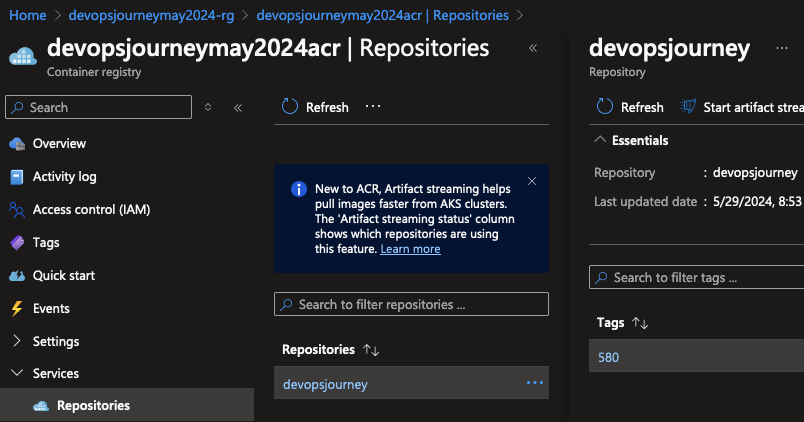

# Deploy sample Application to Container Registry

## 🎯 Purpose
Deploy a sample application to the Azure Container Registry (ACR) and ensure it's ready for further use in your Azure environment.

## 1. Test the Docker Image Locally

1. Build and run the Docker image on your local machine. Follow the instructions [here](docker-image-locally.md).
2. Verify the application's functionality

### 🔍 Verification:
1. Confirm the application runs without errors locally

### 🧠 Knowledge Check:
1. Why is local testing important before deploying to ACR?

#### 💡 Pro Tip: Use Docker Compose for local testing if your application has multiple services.

## 2. Create ACR Service Connection in Azure DevOps

We aim to run the Docker build and publish the image directly to the Azure Container Registry created in lab 2.

1.  Create a new service connection for ACR access that will authenticate using Workload Identity federation.
- In your Azure DevOps Project, go to Project Settings.
- Select Service Connections.
- Click New Service Connection and choose Docker Registry.
- Select the registry type: Azure Container Registry.
- Choose the correct ACR and create a service connection name. For example, devopsjourneyoct2024acr

### 🔍 Verification:
1. Confirm the service connection is created and functional

### 🧠 Knowledge Check:
1. Why is Workload Identity federation preferred for authentication?

#### 💡 Pro Tip: Use a naming convention for your service connections to easily identify their purpose.

## 3. Copy Application to Azure DevOps Repository

## 4. Copy Application Folder to Azure DevOps Repository

1. Update pipeline in Azure DevOps repo with the below updates:
- [Updated variables](https://github.com/thomast1906/DevOps-Journey-Using-Azure-DevOps/blob/main/labs/3-Deploy-App-to-ACR/pipelines/lab3pipeline.yaml#L23-L28)
  - repository: ACR repository name
  - dockerfile: Dockerfile location
  - containerRegistry: Service connection name of container registry
- [Add Build Stage](https://github.com/thomast1906/DevOps-Journey-Using-Azure-DevOps/blob/main/labs/3-Deploy-App-to-ACR/pipelines/lab3pipeline.yaml#L89-L102)

2. Copy the `app` folder to your Azure DevOps repository.

### 🔍 Verification:
1. Ensure all necessary files are present in the repository.

### 🧠 Knowledge Check:
1. How does storing application code in the same repository as pipeline code benefit the project?
2. What is the purpose of each variable you're updating?

#### 💡 Pro Tip: Use variable groups in Azure DevOps to manage environment-specific variables.

## 5. Run Azure DevOps Pipeline and Review Results

1. Run pipeline, you will see an additional stage on pipeline

2. Reviewing in ACR, you will see the image 

### 🔍 Verification:
1. Confirm the new stage completes successfully
2. Check ACR for the newly pushed image

### 🧠 Knowledge Check:
1. How would you troubleshoot if the new stage fails?

#### 💡 Pro Tip: Set up automated notifications for pipeline failures to catch issues early.