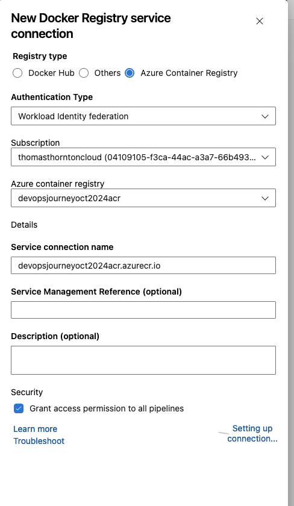

# Deploy sample Application to Container Registry

This lab is to deploy the same Application to Container Registry

1. `cd` into the *Docker* directory where you will see a *Dockerfile* and *app* directory. The app directory is what stores the Python application and the Dockerfile will be used to build the app.

2. Open the Dockerfile & view the steps
    - The Docker image being used is dotnet core
    - A directory /app will be used to store application
    - The app will run as soon as the container gets created and comes up

3. The Docker image can be built and ran locally to test - see [here](docker-image-locally.md)

4. We want to run this Docker build and publish directly to the created Azure Container Registry in lab 2. 

5. Create a new service connection for ACR access.
   - Within your Azure DevOps Project – select **Project Settings**
   - Select **Service Connections** -> **Docker Registry** -> Select registry type: **Azure Container Registry**
   - Select correct ACR and create service connection name. I have given devopsjourneyacr.azurecr.io as my service connection name

