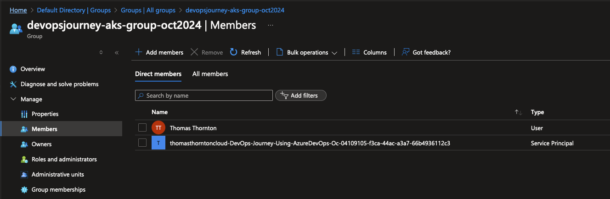

# Update Azure AD Group with Service Principal and Configure Application Insights variable in Key Vault

## 🎯 Purpose
Add the Docker service principal to the Azure AD group and set up Application Insights variable that will be used by the application/pipeline.

## 1. Add Service Principal to Azure AD Group

1. Locate the service principal created by Workload Identity Federation

As using Workload Identity Federation, I found the service principal it created from here:


2. Add the service principal that docker uses to the Azure AD group that was created in the initial setup [here](https://github.com/thomast1906/DevOps-Journey-Using-Azure-DevOps/blob/main/labs/1-Initial-Setup/3-Create-Azure-AD-AKS-Admins.md)

### 🔍 Verification:
1. Confirm the service principal appears in the group members list


### 🧠 Knowledge Check:
1. Why is it important to add the service principal to this group?
2. How does this affect the permissions of the Docker service?

#### 💡 Pro Tip: Regularly audit your Azure AD groups to ensure proper access control.

## 2. Get Application Insights Instrumentation Key & Add Application Insights Key to Key Vault

1. Get Azure Application Insights Instrumentation Key using Az CLI:
- Change the resource group and app insights name to your values

```bash
az extension add --name application-insights
az monitor app-insights component show --app devopsjourneyoct2024ai -g devopsjourneyoct2024-rg --query instrumentationKey -o tsv
```

Example output:
```bash
az monitor app-insights component show --app devopsjourneyoct2024ai -g devopsjourneyoct2024-rg --query instrumentationKey -o tsv
8896c09a-a3e3-4a72-9914-f826e85c6a5f
```

### 🔍 Verification:
1. Ensure you receive a valid instrumentation key

2. Add This key to Key Vault as secret `AIKEY`
- Change the key vault name to your value and the key to the value you got from the previous step

```bash
az keyvault secret set --vault-name "devopsjourneyoct2024-kv" --name "AIKEY" --value "App_insights_key_value"
```

### 🧠 Knowledge Check:
1. Why is it beneficial to store the instrumentation key in Key Vault?
2. How does this improve the security of your application?

#### 💡 Pro Tip: Use Azure Key Vault references in your application to dynamically retrieve secrets at runtime.

## 3. Create a Variable Group in Azure DevOps

1. Navigate to Pipelines -> Library in Azure DevOps
2. Create a new variable group named "devopsjourney"
3. Add necessary variables, linking to Key Vault secrets where appropriate:


### 🔍 Verification:
1. Ensure the variable group is created and contains the expected variables

### 🧠 Knowledge Check:
1. How do variable groups in Azure DevOps enhance pipeline management?
2. What are the benefits of linking variables to Key Vault secrets?

#### 💡 Pro Tip: Use variable groups to manage environment-specific configurations, making it easier to maintain different deployment stages.