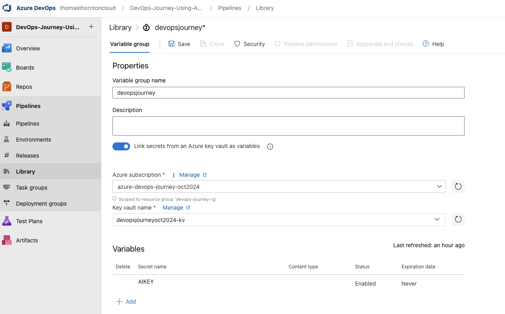

# Update Azure AD Group with Service Principal that Docker uses

1. Add the service principal that docker uses to the Azure AD group that was created in the initial setup [here](https://github.com/thomast1906/DevOps-Journey-Using-Azure-DevOps/blob/main/labs/1-Initial-Setup/3-Create-Azure-AD-AKS-Admins.md)

2. Get Azure Application Insights Instrumentation Key using Az CLI:
- Change the resource group and app insights name to your values

`az extension add --name application-insights`
`az monitor app-insights component show --app devopsjourneymay2024ai -g devopsjourneymay2024-rg --query instrumentationKey -o tsv`

7. Add This key to Key Vault as secret `AIKEY`
- Change the key vault name to your value and the key to the value you got from the previous step

`az keyvault secret set --vault-name "devopsjourneymay2024-kv" --name "AIKEY" --value "App_insights_key_value"`

8. Once the Key Vault has been created - create a new variable group: devopsjourney as below.
- In Azure DevOps go to Pipelines -> Library -> + Variable Group

