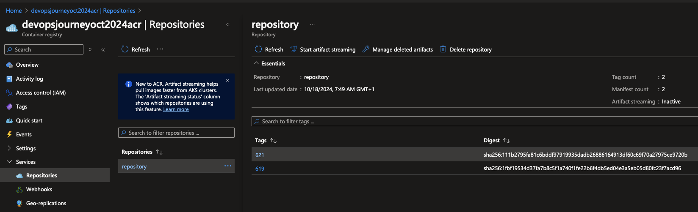
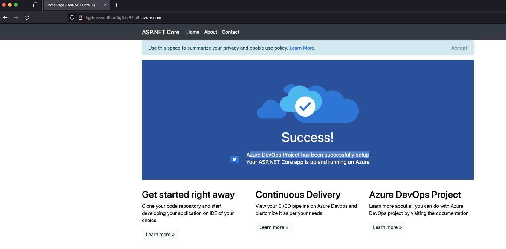

# Update Pipeline to Deploy Application to AKS

## 🎯 Purpose
Modify the Azure DevOps pipeline to deploy an application to Azure Kubernetes Service (AKS).

## Modify YAML File with ACR Details

1. Update the YAML file with your Azure Container Registry (ACR) name and image tag

You can find the specific line to update [here](https://github.com/thomast1906/DevOps-Journey-Using-Azure-DevOps/blob/main/labs/4-Deploy-App-AKS/pipelines/scripts/app.yaml#L24)

```bash
image: devopsjourneyoct2024acr.azurecr.io/repository:626
```




### 🔍 Verification:
1. Confirm the image reference is correctly updated in the YAML file

### 🧠 Knowledge Check:
1. Why is it important to use the correct ACR name and image tag?
2. How does this ensure the correct image is pulled during deployment?

#### 💡 Pro Tip: Use variables in your YAML files to make it easier to update image references across multiple environments.

## Update Azure DevOps Pipeline

1. Update the Pipeline in Azure DevOps Repository

- Add Deploy Sample Application Stage:
Incorporate the stage to deploy the sample application as shown [here](https://github.com/thomast1906/DevOps-Journey-Using-Azure-DevOps/blob/main/labs/4-Deploy-App-AKS/pipelines/lab4pipeline.yaml#L104-L144)

2. Update resource names in the pipeline YAML

Update the resource names as shown [here]((https://github.com/thomast1906/DevOps-Journey-Using-Azure-DevOps/blob/main/labs/4-Deploy-App-AKS/pipelines/lab4pipeline.yaml#L123-L131))

```bash
  RESOURCE_GROUP="devopsjourneyoct2024-rg"
  AKS_NAME="devopsjourneyoct2024"
  helm_resource_namespace="azure-alb-system"
  VNET_NAME="devopsjourneyoct2024-vnet"
  ALB_SUBNET_NAME="appgw"
  ALB_CONTROLLER_VERSION="1.0.0"
  ALB_RESOURCE_NAME='devopsjourneyoct2024-alb'
  ALB_FRONTEND_NAME='alb-frontend'
  APP_NAMESPACE='thomasthorntoncloud'
```

  - RESOURCE_GROUP: AKS Resource Group Name 
  - AKS_NAME: AKS Cluster Name
  - VNET_NAME: VNET Name
  - APP_NAMESPACE: Namespace for the Application

The other values are used to deploy the Azure Application Gateway for Containers and should not be changed in this lab.

This script will retrieve the AKS credentials and deploy the specified YAML file, which will in turn deploy the sample application along with its associated service and ingress (Azure Application Gateway for Containers).

3. Notice reference of [AIKEY](https://github.com/thomast1906/DevOps-Journey-Using-Azure-DevOps/blob/main/labs/4-Deploy-App-AKS/pipelines/lab4pipeline.yaml#L131)? You created and added this to a variable group in a previous step. 


### 🔍 Verification:
1. Review the added stage in the pipeline
2. Ensure all resource names are correctly updated

### 🧠 Knowledge Check:
1. What is the purpose of each resource name in the pipeline?
2. How does the Azure Application Gateway for Containers fit into this deployment?

#### 💡 Pro Tip: Use Azure Pipeline variables or variable groups to manage environment-specific values, making it easier to reuse the pipeline across different environments.

## Test the Application

1. Access the Fully Qualified Domain Name (FQDN) to view the sample application.

```bash
fqdn=$(kubectl get gateway gateway-01 -n thomasthorntoncloud -o jsonpath='{.status.addresses[0].value}')
echo "http://$fqdn"
```

2. Access the application using the obtained FQDN

Use the address obtained to access the application, for example:
```bash
http://hgduczcae6bad4g5.fz82.alb.azure.com
```



### 🔍 Verification:
1. Confirm the application is accessible via the provided URL
2. Check that the application functions as expected

### 🧠 Knowledge Check:
1. How is the FQDN generated for the application?
2, What role does the Azure Application Gateway for Containers play in routing traffic to your application?

#### 💡 Pro Tip: Set up monitoring alerts based on application availability and performance metrics to proactively identify issues. Which we will do in lab 6 :)