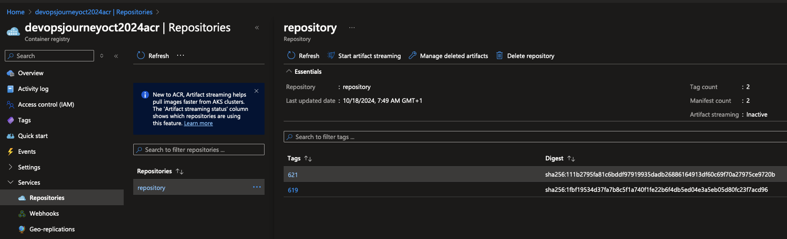
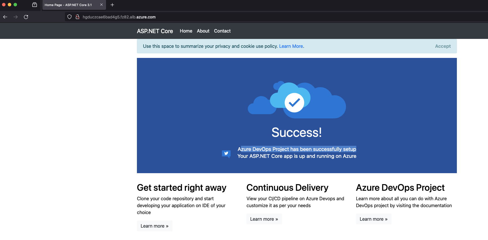

# 🚢 Deploy Application to AKS

> **Estimated Time:** ⏱️ **20-30 minutes**

## 🎯 **Learning Objectives**

By the end of this lab, you will:
- [ ] **Update `app.yaml`** — with the correct ACR image reference for your environment
- [ ] **Add a Deploy stage to the pipeline** — to `kubectl apply` the application to AKS
- [ ] **Configure pipeline resource names** — AKS cluster, resource group, namespace, and VNet
- [ ] **Test the deployed application** — via the Azure Application Gateway for Containers FQDN

## 📋 **Prerequisites**

**✅ Required Knowledge:**
- [ ] Kubernetes manifest basics (Deployment, Service, Ingress)
- [ ] AKS `kubectl` access concepts

**🔧 Required Tools:**
- [ ] `kubectl` installed locally (for validation)
- [ ] Azure CLI authenticated

**🏗️ Infrastructure Dependencies:**
- [ ] Completed [Lab 4.1 — AD Group and Key Vault Setup](./1-Update-AD-Group-and-Add-KeyVault-Secret.md)
- [ ] Docker image built and pushed to ACR (Lab 3) — note the build ID tag
- [ ] Variable group `devopsjourney` created with `AIKEY` secret

---

## 🚀 **Step-by-Step Implementation**

### **Step 1: Update `app.yaml` with Your ACR Image** ⏱️ *5 minutes*

1. **📝 Open the Kubernetes manifest**

   Open [`labs/4-Deploy-App-AKS/pipelines/scripts/app.yaml`](https://github.com/thomast1906/DevOps-Journey-Using-Azure-DevOps/blob/main/labs/4-Deploy-App-AKS/pipelines/scripts/app.yaml) and update the image reference:

   ```yaml
   image: devopsjourneyoct2024acr.azurecr.io/repository:626
   ```

   Replace `devopsjourneyoct2024acr` with your ACR name and `626` with the Build ID from the last successful pipeline run.

   

   > 💡 You can find the build ID in Azure DevOps → Pipelines → last successful run → the run number is the Build ID used as the image tag.

---

### **Step 2: Add the Deploy Stage to the Pipeline** ⏱️ *10 minutes*

1. **📝 Add the deploy stage**

   Add the Deploy stage to your pipeline YAML as shown in [`labs/4-Deploy-App-AKS/pipelines/lab4pipeline.yaml`](https://github.com/thomast1906/DevOps-Journey-Using-Azure-DevOps/blob/main/labs/4-Deploy-App-AKS/pipelines/lab4pipeline.yaml#L104-L144).

2. **🔧 Update resource names in the pipeline script**

   Find and update the environment variable block in the deploy stage:

   ```bash
   RESOURCE_GROUP="devopsjourneyoct2024-rg"     # AKS Resource Group
   AKS_NAME="devopsjourneyoct2024"              # AKS Cluster Name
   VNET_NAME="devopsjourneyoct2024-vnet"        # VNet Name
   ALB_RESOURCE_NAME='devopsjourneyoct2024-alb' # Azure ALB name (do not change)
   APP_NAMESPACE='thomasthorntoncloud'           # K8s namespace for the app
   helm_resource_namespace="azure-alb-system"   # ALB system namespace (do not change)
   ALB_SUBNET_NAME="appgw"                      # ALB subnet name (do not change)
   ALB_CONTROLLER_VERSION="1.0.0"               # ALB controller version (do not change)
   ALB_FRONTEND_NAME='alb-frontend'             # ALB frontend name (do not change)
   ```

   > ⚠️ Only change `RESOURCE_GROUP`, `AKS_NAME`, `VNET_NAME`, and `APP_NAMESPACE`. The remaining values relate to the Azure Application Gateway for Containers and should not be modified.

3. **🔑 The `AIKEY` variable reference**

   The pipeline references `$(AIKEY)` from the `devopsjourney` variable group to create a Kubernetes secret:

   ```yaml
   kubectl create secret generic aikey \
     --from-literal=aisecret="$(AIKEY)" \
     --namespace thomasthorntoncloud \
     --dry-run=client -o yaml | kubectl apply -f -
   ```

   The `app.yaml` manifest then injects this as `APPLICATIONINSIGHTS_CONNECTION_STRING`:

   ```yaml
   env:
     - name: APPLICATIONINSIGHTS_CONNECTION_STRING
       valueFrom:
         secretKeyRef:
           name: aikey
           key: aisecret
   ```

   See reference in [`lab4pipeline.yaml`](https://github.com/thomast1906/DevOps-Journey-Using-Azure-DevOps/blob/main/labs/4-Deploy-App-AKS/pipelines/lab4pipeline.yaml#L131).

---

### **Step 3: Run the Pipeline** ⏱️ *10 minutes*

1. **💾 Commit and push the updated pipeline and manifests**

   ```bash
   git add pipelines/ app.yaml
   git commit -m "Add AKS deploy stage with App Insights secret injection"
   git push
   ```

2. **▶️ Run the pipeline** in Azure DevOps and observe all three stages:
   - **Validate** — Terraform validate
   - **Build** — Docker build and push to ACR
   - **Deploy** — AKS deployment via kubectl

   **✅ Expected Output (Deploy stage logs):**
   ```
   Merged "devopsjourneyoct2024" as current context in /home/vsts/.kube/config
   namespace/thomasthorntoncloud created (or unchanged)
   secret/aikey configured
   deployment.apps/thomasthornton configured
   service/thomasthornton-service configured
   gateway.gateway.networking.k8s.io/gateway-01 configured
   httproute.gateway.networking.k8s.io/http-route configured
   ```

---

### **Step 4: Test the Deployed Application** ⏱️ *3 minutes*

1. **🔑 Get AKS credentials**

   ```bash
   az aks get-credentials \
     --name devopsjourneyoct2024 \
     --resource-group devopsjourneyoct2024-rg \
     --overwrite-existing
   ```

2. **🌐 Get the application FQDN**

   ```bash
   fqdn=$(kubectl get gateway gateway-01 \
     -n thomasthorntoncloud \
     -o jsonpath='{.status.addresses[0].value}')
   echo "Application URL: http://$fqdn"
   ```

   **✅ Expected Output:**
   ```
   Application URL: http://hgduczcae6bad4g5.fz82.alb.azure.com
   ```

3. **✅ Test the application**

   ```bash
   curl -s -o /dev/null -w "%{http_code}" "http://$fqdn"
   # Expected: 200
   ```

   Or open `http://hgduczcae6bad4g5.fz82.alb.azure.com` in your browser:

   

---

## ✅ **Validation Steps**

**🔍 Infrastructure Validation:**
- [ ] Pipeline Deploy stage completes successfully
- [ ] Pods are running in the `thomasthorntoncloud` namespace
- [ ] Application is reachable via the ALB FQDN
- [ ] `APPLICATIONINSIGHTS_CONNECTION_STRING` is present in the pod environment

**🔧 Technical Validation:**
```bash
# Get AKS credentials
az aks get-credentials --name devopsjourneyoct2024 --resource-group devopsjourneyoct2024-rg

# Check pod status
kubectl get pods -n thomasthorntoncloud

# Verify the App Insights secret is injected correctly
kubectl describe pod -n thomasthorntoncloud \
  $(kubectl get pods -n thomasthorntoncloud -o jsonpath='{.items[0].metadata.name}') \
  | grep -A2 "APPLICATIONINSIGHTS_CONNECTION_STRING"

# Test application availability
fqdn=$(kubectl get gateway gateway-01 -n thomasthorntoncloud -o jsonpath='{.status.addresses[0].value}')
curl -s -o /dev/null -w "HTTP Status: %{http_code}\n" "http://$fqdn"
```

**✅ Expected Output:**
```
NAME                               READY   STATUS    RESTARTS   AGE
thomasthornton-85cccb565d-qdltc    1/1     Running   0          2m

      APPLICATIONINSIGHTS_CONNECTION_STRING:  <set to the key 'aisecret' in secret 'aikey'>

HTTP Status: 200
```

---

## 🚨 **Troubleshooting Guide**

**❌ Common Issues:**

```bash
# Problem: Pod in CrashLoopBackOff
# Solution: Check pod logs for Python errors
kubectl logs -n thomasthorntoncloud \
  $(kubectl get pods -n thomasthorntoncloud -o jsonpath='{.items[0].metadata.name}')

# Problem: ImagePullBackOff — cannot pull from ACR
# Solution: Verify AKS has AcrPull role on the ACR (set by Terraform)
az role assignment list \
  --scope "/subscriptions/<sub>/resourceGroups/<rg>/providers/Microsoft.ContainerRegistry/registries/devopsjourneyoct2024acr" \
  --query "[?principalType=='ServicePrincipal'].{Principal:principalName, Role:roleDefinitionName}" -o table

# Problem: FQDN returns 503 or no response
# Solution: Wait 2-3 minutes for ALB provisioning, then re-check
kubectl get gateway gateway-01 -n thomasthorntoncloud
kubectl describe httproute http-route -n thomasthorntoncloud

# Problem: kubectl commands fail with "Forbidden"
# Solution: Ensure your user or the WIF SP is in the AKS admin group
az ad group member list --group "devopsjourney-aks-group-oct2024" \
  --query "[].displayName" -o tsv
```

---

## 💡 **Knowledge Check**

**🎯 Questions:**
1. How does the pipeline inject the App Insights connection string into the running pod?
2. What Kubernetes resources does `app.yaml` create?
3. Why is the ALB controller deployed to the `azure-alb-system` namespace rather than `thomasthorntoncloud`?
4. What happens if you re-run the deploy stage without deleting existing resources?

**📝 Answers:**
1. **Via a Kubernetes secret** — the pipeline runs `kubectl create secret generic aikey --from-literal=aisecret="$(AIKEY)"`. The `app.yaml` Deployment spec then references this secret with `valueFrom.secretKeyRef`, making the connection string available as the `APPLICATIONINSIGHTS_CONNECTION_STRING` environment variable inside the container. The `azure-monitor-opentelemetry` SDK detects this variable at startup and configures the OpenTelemetry exporter automatically.
2. **`app.yaml` creates**: a Kubernetes `Namespace`, a `Deployment` (Flask app pods), a `Service` (ClusterIP), a `Gateway` (Application Gateway for Containers), and an `HTTPRoute` (routing rules). Together these expose the app via the Azure ALB FQDN.
3. **The ALB controller is a cluster-wide component** — it watches Gateway and HTTPRoute resources across all namespaces and manages Azure Application Gateway for Containers. It runs in `azure-alb-system` by convention, separate from application workloads.
4. **`kubectl apply` is idempotent** — re-running the deploy stage updates in-place. The Deployment performs a rolling update: new pods are started before old pods are terminated, ensuring zero downtime. The `aikey` secret is also updated idempotently via `--dry-run=client -o yaml | kubectl apply -f -`.

---

## 🎯 **Next Steps**

**✅ Upon Completion:**
- [ ] `app.yaml` updated with correct ACR image reference
- [ ] Deploy stage added to pipeline YAML
- [ ] Pipeline runs all three stages successfully
- [ ] Application accessible via ALB FQDN

**➡️ Continue to:** [Lab 5 — Introduce CI/CD Triggers](../5-CICD/1-Introduce-CI-CD-to-your-Pipeline.md)

---

## 📚 **Additional Resources**

- 🔗 [AKS — Deploy applications](https://learn.microsoft.com/en-us/azure/aks/tutorial-kubernetes-deploy-application)
- 🔗 [Azure Application Gateway for Containers](https://learn.microsoft.com/en-us/azure/application-gateway/for-containers/overview)
- 🔗 [Kubernetes — Rolling update strategy](https://kubernetes.io/docs/concepts/workloads/controllers/deployment/#rolling-update-deployment)
- 🔗 [kubectl cheat sheet](https://kubernetes.io/docs/reference/kubectl/cheatsheet/)