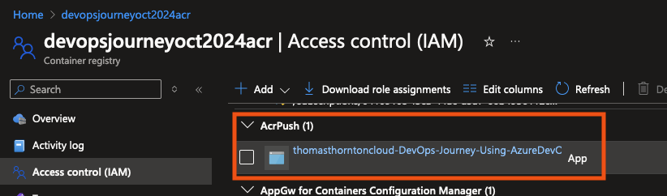
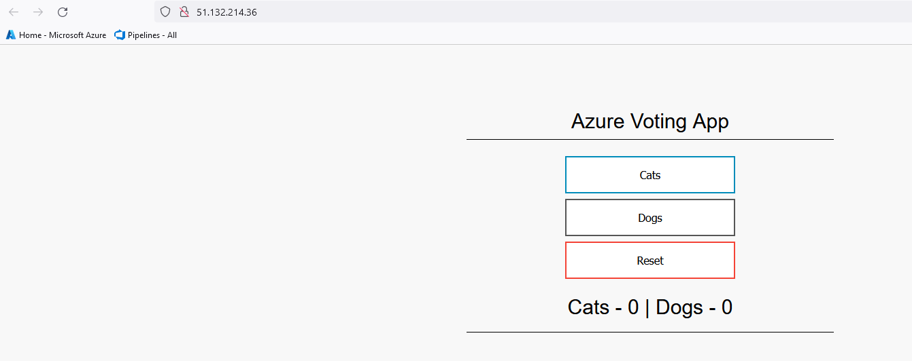

# Update Pipeline to Deploy asp Application to AKS

1. Update .yaml with your ACR image name

https://github.com/thomast1906/DevOps-Journey-Using-Azure-DevOps/blob/main/labs/4-Deploy-App-AKS/pipelines/scripts/aspnet.yaml#L19

example:
`        image: devopsjourneyacr.azurecr.io/devopsjourney:68`

2. Update pipeline in Azure DevOps repo with the below updates:
- [Add Deploy sample application stage to Azure DevOps Pipeline](https://github.com/thomast1906/DevOps-Journey-Using-Azure-DevOps/blob/main/labs/4-Deploy-App-AKS/pipelines/lab4pipeline.yaml#L141-L167)
- [Update Values](https://github.com/thomast1906/DevOps-Journey-Using-Azure-DevOps/blob/main/labs/4-Deploy-App-AKS/pipelines/lab4pipeline.yaml#L157-L158)
  - AKS_RG: AKS Resource Group Name 
  - AKS_NAME: AKS Cluster Name
- This script will get AKS credientals and deploy above .yaml file that will deploy sample application 

1. Notice reference of [AIKEY](https://github.com/thomast1906/DevOps-Journey-Using-Azure-DevOps/blob/main/labs/4-Deploy-App-AKS/pipelines/lab4pipeline.yaml#L164)? You created and added this to a variable group in a previous step. 

3. Test app on K8s cluster

- Review **Services and ingresses** in Azure Portal
  - Select **ingresses** tab and review **sample application** address

Access IP address, the sample application will display

