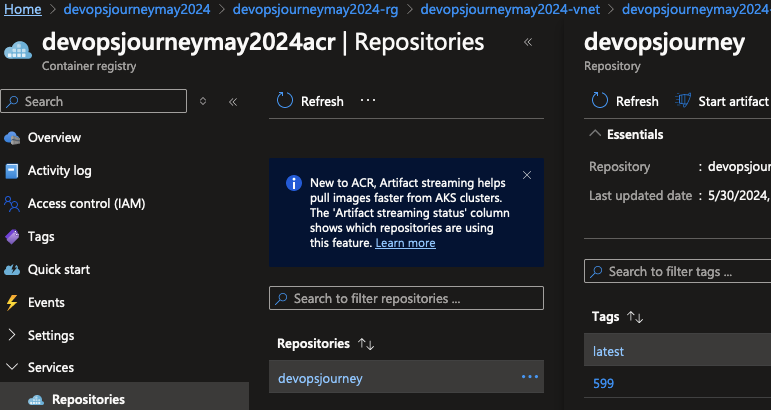

# Automated Deployment of Your AKS Application

# 🎯 Purpose
Implement continuous integration and continuous deployment (CI/CD) for your AKS application, ensuring automatic updates with each pipeline run. In previous labs, the application build tag was manually set up. 

## 1. Review the app.yaml File
1. Previously, the image build version was hardcoded. This meant that to update the pods on the cluster, you had to delete the Kubernetes deployment and rerun the pipeline with the new build version. This approach is not ideal as it does not support zero-downtime deployments.

```bash
image: devopsjourneymay2024acr.azurecr.io/devopsjourney:123
```

### 🔍 Verification:
1. Confirm the hardcoded image version in the app.yaml file

### 🧠 Knowledge Check:
1. Why is a hardcoded image version problematic for CI/CD?
2. What are the drawbacks of manually deleting and redeploying for updates?

#### 💡 Pro Tip: Always consider zero-downtime deployment strategies when designing your CI/CD pipeline.


## 2. Update Image Tag and Introduce `imagePullPolicy`

1. Change the image tag to latest and add an imagePullPolicy to ensure the latest image is always pulled when the pods are updated.

```bash
image: devopsjourneymay2024acr.azurecr.io/devopsjourney:latest
imagePullPolicy: Always
```

The `imagePullPolicy` determines when the kubelet attempts to pull (download) the specified image. Here are the possible values:
- **IfNotPresent:** The image is pulled only if it is not already present locally.
- **Always:** Every time the kubelet launches a container, it queries the container image registry to resolve the image name to a digest. If the image is not cached locally, the kubelet pulls it and uses it to launch the container.
- **Never:** The kubelet does not try to fetch the image. If the image is present locally, the kubelet attempts to start the container; otherwise, the startup fails.

### 🔍 Verification:
1. Ensure both the image tag and imagePullPolicy are correctly set in the YAML file

### 🧠 Knowledge Check:
1. What are the different imagePullPolicy options and their use cases?
2. Why is 'Always' particularly useful in a CI/CD context?

#### 💡 Pro Tip: While 'latest' is convenient for CI/CD, consider using specific version tags in production for better traceability and rollback capabilities.


## 3. Edit Your app.yaml File & Update Pipeline Tag

1. Make the necessary changes to the app.yaml file as shown [here](https://github.com/thomast1906/DevOps-Journey-Using-Azure-DevOps/blob/main/labs/5-CICD/pipelines/scripts/app.yaml#L19-L20)
2. Update the Pipeline Tag 

Previously, the pipeline tag was set to the latest Build ID:

```yaml
tags: $(Build.BuildId)
```

Which will tag with the latest BuildId each time of the pipeline. 

3. Update this to latest to ensure the latest build is always used:

```yaml
tags: 'latest'
```

4. Modify this in your pipeline file [here](https://github.com/thomast1906/DevOps-Journey-Using-Azure-DevOps/blob/main/labs/5-CICD/pipelines/lab5pipeline.yaml#L108)

### 🔍 Verification:
1. Double-check that the changes are correctly applied to the app.yaml file
2. Confirm the tag change in your pipeline file

### 🧠 Knowledge Check:
1. How does this change affect the deployment process?
2. What potential issues could arise from using 'latest' in production?
3. How does using 'latest' instead of $(Build.BuildId) impact your deployment strategy?
4. What are the pros and cons of using 'latest' versus unique build IDs?

#### 💡 Pro Tip: Use version control to track changes to your Kubernetes manifests, enabling easy rollbacks if needed.


## 5. Merge changes and verify

Once you merge these changes, the pipeline will run automatically. In the Azure Container Registry (ACR), you will see a new tag `latest`. This tag will be used to update the pods on the AKS cluster.



As we changed the `imagePullPolicy` to `Always`, reviewing the K8s cluster, you will see a new pod also with the `latest` image tag

```bash 
kubectl describe pod thomasthornton-85cccb565d-qdltc | grep Image
Image:          devopsjourneyoct2024acr.azurecr.io/repository:latest
```

Congratulations! You've successfully implemented CI/CD and automated deployments for your AKS application.

### 🔍 Verification:
1. Confirm the 'latest' tag in ACR
2. Check for new pods in the AKS cluster using the 'latest' image

### 🧠 Knowledge Check:
1. How does the imagePullPolicy affect the pod update process?
2. What would happen if you reverted to an older commit with this setup?

#### 💡 Pro Tip: Implement monitoring and alerting to quickly identify any issues with new deployments using the 'latest' tag.

