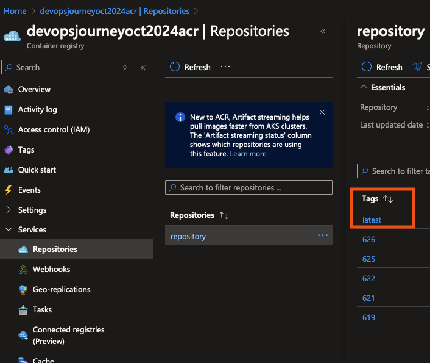

# Automated Deployment of Your AKS Application

In previous labs, the application build tag was manually set up. In a CI/CD pipeline, this process will be automated, ensuring that the application on the AKS cluster updates each time the pipeline runs.

In this lab, we will create an automated deployment for your AKS application.

1. Review the aspnet.yaml File

Previously, the image build version was hardcoded. This meant that to update the pods on the cluster, you had to delete the Kubernetes deployment and rerun the pipeline with the new build version. This approach is not ideal as it does not support zero-downtime deployments.

`image: devopsjourneymay2024acr.azurecr.io/devopsjourney:123`

2. Update the Image Tag and Introduce `imagePullPolicy`

Change the image tag to latest and add an imagePullPolicy to ensure the latest image is always pulled when the pods are updated.

`        image: devopsjourneymay2024acr.azurecr.io/devopsjourney:latest
        imagePullPolicy: Always`

The `imagePullPolicy` determines when the kubelet attempts to pull (download) the specified image. Here are the possible values:
- **IfNotPresent:** The image is pulled only if it is not already present locally.
- **Always:** Every time the kubelet launches a container, it queries the container image registry to resolve the image name to a digest. If the image is not cached locally, the kubelet pulls it and uses it to launch the container.
- **Never:** The kubelet does not try to fetch the image. If the image is present locally, the kubelet attempts to start the container; otherwise, the startup fails.

3. Edit Your aspnet.yaml File

Make the necessary changes to the aspnet.yaml file as shown [here](https://github.com/thomast1906/DevOps-Journey-Using-Azure-DevOps/blob/main/labs/5-CICD/pipelines/scripts/aspnet.yaml#L19-L20)

4. Update the Pipeline Tag 

Previously, the pipeline tag was set to the latest Build ID:

`tags: $(Build.BuildId)`

Which will tag with the latest BuildId each time of the pipeline. 

Update this to latest to ensure the latest build is always used:

`tags: 'latest'`

Modify this in your pipeline file [here](https://github.com/thomast1906/DevOps-Journey-Using-Azure-DevOps/blob/main/labs/5-CICD/pipelines/lab5pipeline.yaml#L106)

5. Merge changes and verify

Once you merge these changes, the pipeline will run automatically. In the Azure Container Registry (ACR), you will see a new tag `latest`. This tag will be used to update the pods on the AKS cluster.

As we changed the `imagePullPolicy` to `Always`, reviewing the K8s cluster, you will see a new pod also with the `latest` image tag

`kubectl describe pod aspnetcore | grep Image
Image:          devopsjourneymay2024acr.azurecr.io/devopsjourney:latest`

Congratulations! You've successfully implemented CI/CD and automated deployments for your AKS application.

